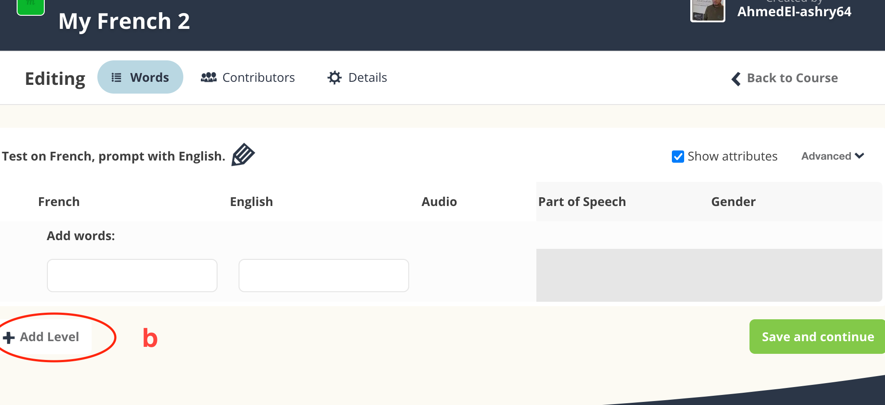
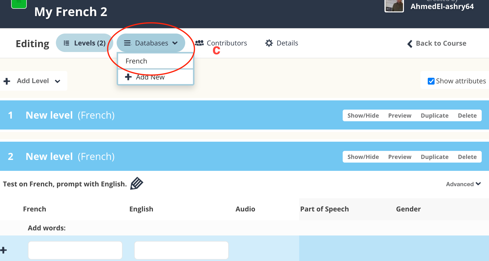
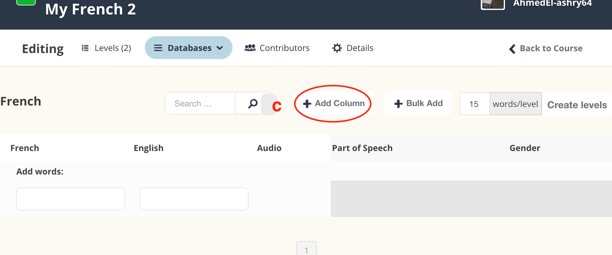
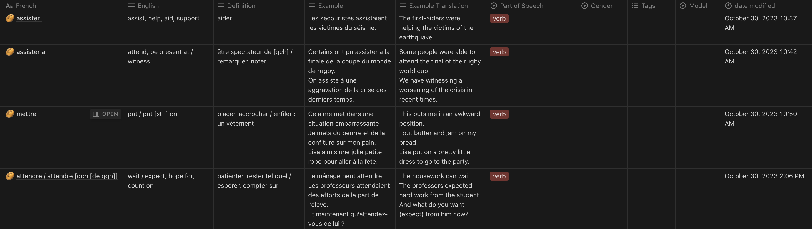

# About

I am using [Notion](https://www.notion.so/) to create a database of words I want to learn in a foreign language, and I am using [Memrise](https://www.memrise.com/) to learn them through their scientific time-spaced memorization algorithm.
This project is a way to automate the process of creating a course on Memrise from a database on Notion.

Why not just use Memrise directly?  
Notion is easier to use and had more features. For example, I can add much more notes to a single word on Notion including embedding videos to how to use it, for example.

# How to use

1. On Notion: Create a database. It must contain at least three columns: one for the language you want to learn, one for the language you already know, say, French and English, and one for the last modified data named `date modified`.
2. On Memrise:  
    a. Create a course (follow these [instructions](https://memrise.zendesk.com/hc/en-us/articles/360015973338-How-can-I-create-a-course-make-a-learning-list-)).   
    b. Convert the course into complex mode by simply adding another level to the course, so you have two empty levels.  
    c. (optional if you want to add more columns to the course) Go to the database tab of the course, and click on the automatically created one, and add more columns.    
    d. save changes (in the levels tab).
<p align="center">
  
   
  
</p>  

3. Clone this repository
4. Follow the [requirements](#requirements) section below
5. Change the constants in `src/constants`.
6. Run `python notion2memrise.py` from the root directory.

# How does it work
### Notion
The database on Notion would look like:



We use their API to query the database. An extra piece of information we get from the API is a unique ID for each cell/page in the database. We will use this ID to link words in the notion database to words on the memrise course.


### TODO:
- [x] ~~get the database via API~~
- [x] ~~create a pandas dataframe from the database~~
- [x] ~~clean the dataframe~~
- [x] ~~handle duplicates in the notion database~~
- [ ] reorganise the constants in the code
- [ ] testing modules for the above

### Memrise
Memrise does not offer an API, so I went to the old goody Selenium to control the course. Therefore, this solution won't scale well, but it does the job for me.
### TODO:
Do I work with the levels page or the database page
- [x] ~~get all words from memrise.~~
- [x] ~~handle words deleted from the notion database~~
- [x] ~~handle words that already exist but have been modified~~
- [x] ~~add words to the course~~
- [ ] reorganise the constants in the code
- [ ] testing modules for the above

# Requirements
- create a Notion integration in your workspace. Follow these [instructions](https://developers.notion.com/docs/create-a-notion-integration).
- Python libraries are defined in `environment.yaml`. 
- You will need to define your own variable:
`NOTION_SECRET`, `MEMRISE_EMAIL`, `MEMRISE_PASSWORD` in in the `environment.yaml` file.
- You can create a conda environment with 
```
conda env create -f environment.yaml
``` 
and activate it with 
```
conda activate notion2memrise
``` 
- You will also need a driver for Selenium (e.g. [`geckodriver`](https://firefox-source-docs.mozilla.org/testing/geckodriver/Support.html) for Firefox or [`ChromeDriver`](https://chromedriver.chromium.org/getting-started) for Chrome ). I am using FireFox in this project.

# Testing 

Well... this is important, but in the meantime, I would rather spend my time learning French :) ... but I will come back to it.

# Limitations
- Words that get deleted from the levels tab on Memrise will not be deleted from the database on Memrise.
- Many will come as I use the code more and more.

# improvements
- Get pronunciation of words from WordReference to Memrise.
- Make sure to delete words from database on Memrise as well.
- Function to create the course on Memrise in complex mode.
- Is it possible to convert these scripts to a Notion integration?